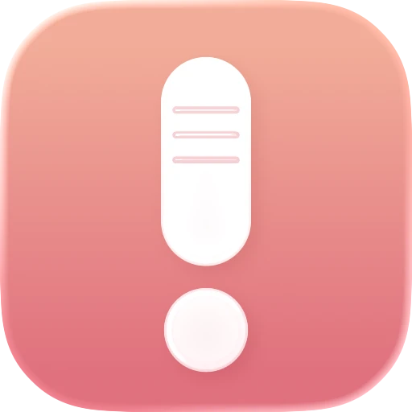
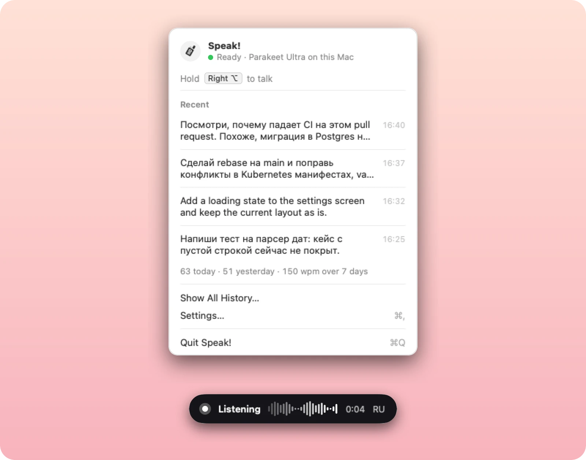

<p align="center">
  
</p>

<h1 align="center">Speak!</h1>

<p align="center">
  <b>Hold a key, talk, let go. The text is already in the field.</b><br />
  Push-to-talk dictation for the Mac menu bar. Local, free, and fast enough to forget it's there.
</p>

<p align="center">
  <a href="https://github.com/danzerzine/Speak/releases/latest"><b>Download for macOS</b></a>
  &nbsp;·&nbsp; macOS 14 or later &nbsp;·&nbsp; Apple Silicon
</p>

<p align="center">
  
</p>

People speak at 130–160 words a minute and type at 40–60. When most of your work is writing prompts for Claude Code, Codex or a chat window, typing speed becomes the limit on how fast you can iterate. Speak! removes it. Hold Right Option, say the whole thought, release, and the text lands in whatever app has focus: a terminal, an editor, a pull request comment.

## Fast because it runs on your Mac

Speech is recognized by **NVIDIA Parakeet** on the Mac itself. On a 2020 MacBook Air with the base M1, a ten-second phrase appears in the field about half a second after you let go of the key. Nothing is uploaded, nothing is billed, and it works offline.

- **Russian and English in one sentence.** "Сделай rebase на main" comes out with `rebase` spelled the way you write it, not transliterated.
- **Your vocabulary, learned once.** If a project name or a library keeps coming out wrong, select it anywhere, right-click, and pick **Fix Spelling in Speak!**. Type the right spelling once and every later dictation gets it right.
- **No clipboard games.** Text is typed straight into the focused field, so your clipboard stays as you left it. Password fields are skipped, and nothing typed into them is saved.
- **Never loses a dictation.** If the text can't be inserted, it's waiting in the menu, one click from the clipboard. If recognition fails, the audio is kept and the menu offers **Retry**.

## What you see

**While you talk**, a small pill shows the live voice level and the time. It sits under the menu bar icon or at the bottom of the screen, in glass or a colour you choose. **When it's done**, the icon pops and the text is in place. No windows open and no toasts appear.

**The menu bar icon tells you the state before you speak**: ready, listening, transcribing, a model loading, or a permission missing. The menu shows the engine, your last dictations, and how much you dictated today.

**First launch takes four short steps**: what the app does, where to recognize speech, three macOS permissions (checked automatically, no "Re-check" buttons), and a practice field to try your first dictation. The model downloads while you grant permissions.

**Settings** follow System Settings: a sidebar with General, Shortcut, Recognition, Dictionary and History.

## Install

1. Download the DMG from [Releases](https://github.com/danzerzine/Speak/releases/latest), open it and drag **Speak.app** into Applications.
2. The app is self-signed, so macOS blocks the first launch. Open **System Settings → Privacy & Security**, find *"Speak was blocked…"* and click **Open Anyway**.
3. Follow the welcome window. Speak! needs three permissions:
   - **Microphone**, to hear you while you hold the key;
   - **Accessibility**, to type the text into the app you're using;
   - **Input Monitoring**, to notice when you hold the hotkey.

Speak! lives in the menu bar (the walkie-talkie icon) and has no Dock icon.

**Updates.** Speak! checks for a new version once a day. When one is out, the menu shows a banner: click **Install…**, then **Install Update**, and the app downloads it, checks its signature, replaces itself and restarts. Settings → General → Updates → **Check Now** checks by hand. Versions before 0.3.3 can't update themselves: install 0.3.3 from the DMG once. Settings, history, dictionaries and models live in `~/Library/Application Support/Speak/` and survive updates.

**Coming from HoldSpeak.** Speak! is the same app under a new name. On first launch it moves your models, history and dictionaries over and keeps your preferences. macOS sees it as a new app, so grant the three permissions once more (the welcome window opens on that step) and delete `HoldSpeak.app`.

## Use

1. Hold **Right Option** (or **Right Command**, the second hotkey). Either can be changed in Settings → Shortcut, and the second can be turned off.
2. Speak.
3. Release. The text is typed into the focused field.

Presses shorter than 150 ms are ignored, and so is a hold during which you press another key, so ⌥-shortcuts keep working. Recording stops on its own after five minutes; the limit is in Settings → Shortcut.

## Recognition engines

| Engine | Where it runs | Size | Good for |
|---|---|---|---|
| **Parakeet Ultra** (default) | On your Mac | 610 MB | Speed. Russian, English and 23 more languages, offline |
| Whisper Tiny / Small / Turbo | On your Mac | 75 MB – 1.5 GB | Languages Parakeet lacks; Turbo for the best Whisper quality |
| Gemini 3.5 Transcribe / Flash-Lite | Google cloud, your API key | — | Heavily mixed-language speech |

Switch engines in Settings → Recognition. Whisper models already downloaded by MacWhisper or another WhisperKit app are found and reused.

**Gemini is optional.** Create a key in [Google AI Studio](https://aistudio.google.com/apikey) and turn on billing for its project: the free tier stops after a couple dozen dictations a day. The key is checked with Google and stored in the macOS Keychain. With Gemini, each dictation's audio goes to Google; the local engines never send anything anywhere.

## Dictionary

Speech models know everyday words and stumble on IT terms: `пулл реквест` instead of *pull request*, `кубернетес` instead of *Kubernetes*. The dictionary maps what was heard to what you meant, per language, and fixes the text before it is typed. It ships with about 110 terms for Russian, 120 for English and 130 for Ukrainian, covering git, languages, frontend, backend, data, DevOps, cloud and AI tools.

With Parakeet the dictionary also works by sound: a small extra model (98 MB) catches words that *sound like* one of your terms, so `пул реквист` still becomes *pull request* even if that exact misspelling isn't in the list.

To add a term, open Settings → Dictionary and fill the always-open row: **Transcribed as** `бойскап` → **Should be** `Basecamp`, Return. Or select the wrong word in any app and choose **Fix Spelling in Speak!** from the context menu. Dictionaries are plain JSON in `~/Library/Application Support/Speak/terminology/` and can be imported, exported and kept in your dotfiles.

## Troubleshooting

- **The hotkey does nothing.** Check Accessibility and Input Monitoring in System Settings → Privacy & Security. The menu bar icon shows an orange badge while a permission is missing.
- **Empty results.** Check the input level in System Settings → Sound → Input, and the microphone chosen in Settings → Recognition.
- **Logs** are in `~/Library/Logs/Speak.log`:

```bash
tail -f ~/Library/Logs/Speak.log
```

## Build from source

Requires Xcode 26 and [XcodeGen](https://github.com/yonaskolb/XcodeGen).

```bash
./scripts/rebuild.sh
```

It generates the project, builds a Release copy, installs it to `/Applications` and signs it. Run `scripts/setup-signing.sh` once so macOS keeps the permissions across rebuilds. `scripts/readme-screenshots.sh` regenerates the image at the top of this page from demo data.

## About this fork

Speak! started as a fork of [timmal/HoldSpeak](https://github.com/timmal/HoldSpeak) and keeps its core idea. It adds the Parakeet engine, the correction dictionary with the Fix Spelling service, Gemini, and a new interface.
